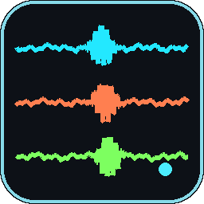

# Raspberry Shake Live Waveform Viewer

A lightweight, OS-independent desktop app for real-time seismograph display from a [Raspberry Shake](https://raspberryshake.org/) via SEEDLINK.

Built for outreach activities at the [Center for Earthquake Research and Information (CERI)](https://www.memphis.edu/ceri/), University of Memphis.



---

## Features

- **Three-channel live display** — EHZ (vertical), EHE (east), EHN (north)
- **SEEDLINK over TCP** — reliable, ordered stream; no RS-side UDP configuration needed
- **Auto-discovery** — finds the RS at `192.168.1.2`, `192.168.1.3`, or `rs.local` in parallel
- **SSH clock sync** — checks and fixes RS clock drift before streaming starts
- **Time-aligned channels** — samples are matched across EHZ/EHE/EHN by their MiniSEED timestamps, not by arrival order
- **Smooth scrolling** — a fixed-rate display clock decouples bursty SEEDLINK delivery from the 60 fps display
- **3D particle motion** — rotatable East/North/Up trace of the ground motion over the last 2–10 s
- **Shared amplitude scaling** — all three channels use the same Y range for direct comparison
- **Lock Scale** — freeze the Y range before touching the RS so handling spikes don't blow up the scale
- **Pause / Resume** — SEEDLINK disconnects on pause; a flat gap scrolls through the plot; live signal resumes seamlessly after the gap
- **Clear** — wipe all traces while staying connected
- **Demo mode** — `--demo` simulates a Raspberry Shake with synthetic quakes; no hardware needed
- **Windows Desktop shortcut** — one-click `build_and_install.bat` bundles everything into a standalone `.exe` with a custom icon

---

## Requirements

- Python 3.9+
- Raspberry Shake connected to the same local network (router)

```bash
pip install PyQt6 pyqtgraph numpy paramiko PyOpenGL
```

`PyOpenGL` is only needed for the 3D particle-motion window; the rest of the app runs without it.

---

## Run

```bash
python raspberryshake_viewer.py
```

On first launch a pre-flight dialog:
1. Discovers the RS on the network
2. SSHs in and checks the RS clock against your machine's UTC
3. Fixes clock drift automatically if > 60 s
4. Connects the SEEDLINK stream and starts displaying

### Demo mode (no Raspberry Shake needed)

```bash
python raspberryshake_viewer.py --demo
```

The app starts a built-in fake Shake: a local SEEDLINK server that streams synthetic EHZ/EHN/EHE data as real Steim-2 MiniSEED records. Everything from the network connection onward runs exactly as it would with real hardware (decoding, channel alignment, display, Pause/Resume, particle motion). Only the pre-flight discovery and clock sync are skipped.

The synthetic ground motion includes:
- background noise and a slow ~0.2 Hz microseism (ocean-wave hum)
- a local quake about every 40 s (the first one ~8 s after start), each from a random direction, with
  - **P wave** — straight-line motion along the ray, tilted up out of the ground
  - **S wave** — larger, horizontal motion at right angles to the ray
  - **Rayleigh wave** — slow, rolling *retrograde* elliptical motion in the vertical plane through the source

A **Quake!** button appears in demo mode to set one off on demand (the P wave arrives about a second later, plus the usual display delay). The status bar counts down to the next automatic quake. Open **Particle Motion** with a 2 s trail to see each phase's shape.

---

## Windows Desktop Shortcut

Put these three files in the same folder:

```
raspberryshake_viewer.py
build_and_install.bat
raspberryshake_icon.ico
```

Double-click `build_and_install.bat`. It will:
- Install all Python dependencies
- Build a standalone `RaspberryShakeViewer.exe` via PyInstaller
- Place a shortcut with the custom icon on your Desktop

> **Note:** Windows Defender may show a SmartScreen warning ("unknown publisher") on first run. Click **More info → Run anyway** — this is normal for locally built executables.

> **Note:** If `python` on your PATH is Inkscape's bundled Python (or another app's), the script uses the Windows Python Launcher `py -3` to find the right installation.

---

## Controls

| Control | Action |
|---------|--------|
| **▲ / ▼** per channel | Zoom that channel in / out (×2 per click) |
| **▲ All / ▼ All** | Zoom all channels together |
| **Reset** | Return all channels to 1× |
| **Lock Scale** | Freeze Y range at the current value (turns amber) |
| **Auto Scale** | Return to adaptive scaling |
| **Clear** | Wipe traces; stream continues |
| **Particle Motion** | Open the 3D particle-motion window (drag to rotate, scroll to zoom) |
| **Quake!** | *(demo mode only)* Trigger a synthetic quake |
| **Pause** | Disconnect SEEDLINK; flat gap scrolls through plot |
| **Resume** | Reconnect; live signal follows the gap |

---

## CLI Options

| Flag | Default | Description |
|------|---------|-------------|
| `--rs-host` | auto | RS hostname or IP |
| `--port` | `18000` | SEEDLINK port |
| `--window` | `60` | Seconds of data visible |
| `--network` | `AM` | SEEDLINK network code |
| `--station` | `R8049` | SEEDLINK station code |
| `--ssh-user` | `myshake` | RS SSH username |
| `--ssh-pass` | `earthday2023` | RS SSH password |
| `--skip-preflight` | off | Skip discovery + clock sync |
| `--demo` | off | Simulate a Raspberry Shake with synthetic quakes (no hardware) |

---

## Particle Motion

The **Particle Motion** window plots the ground's path through space: East on X, North on Y, Up on Z. The trail fades from oldest to newest, and the white dot marks the current position.

Depth cues make the 3D shape readable:
- **Shadows:** the trail is projected onto the floor and the two walls behind it, as faint copies. These act as built-in side views (East–North, East–Up, North–Up). The walls switch as the view turns, so the shadows always stay behind the trail.
- **Drop line:** a thin line from the current point down to its shadow on the floor.
- **Auto-rotate:** a slow turntable rotation, on by default (toggle with the **Auto-rotate** button). It pauses while you drag and resumes 2 s after you let go.
- **Wide-angle perspective:** near parts of the scene look noticeably larger than far ones.

- All three channels are high-passed identically (≈0.5 Hz, trailing 1 s mean removal) to remove the sensor's DC offset and drift without shifting their relative phase.
- All axes share one scale, so the shape of the motion isn't distorted. The full-scale value in counts is shown in the window's top bar.
- Axes follow the physical directions (the board's E/N labels are swapped; see `CHANNEL_LABELS`).
- Choose a 2, 5 or 10 s trail. Shorter trails make linear P-wave motion and elliptical Rayleigh-wave motion easier to see.

The display runs a few seconds behind real time (≈ one MiniSEED record plus network delay). That's the cost of waiting until every channel has data for the same instant.

---

## Network Setup

Connect the laptop and RS to the same router. The RS will get `192.168.1.2` or `192.168.1.3`; the app probes both in parallel so no manual IP entry is needed.

The RS runs a SEEDLINK server on port 18000 by default — no forwarding rules needed.

---

## Troubleshooting

| Symptom | Fix |
|---------|-----|
| Pre-flight can't find RS | Check ethernet cables and RS power; try `ping rs.local` |
| SSH clock sync fails | Verify `--ssh-pass`; RS must be reachable on port 22 |
| "Connected — waiting for first record…" | Normal for a few seconds; SEEDLINK buffers before sending |
| Amber banner stays on | RS may have rebooted; app reconnects automatically |
| Waveforms flat after launch | Wait ~5 s for initial auto-range to kick in |

---

## Testing

```bash
pip install -r requirements-dev.txt
pytest
```

The suite runs headless (Qt offscreen) and takes about 10 seconds. It uses [obspy](https://github.com/obspy/obspy) as an independent reference for MiniSEED (obspy is a test-only dependency; the app doesn't need it). It covers:

- **Decoder** (`tests/test_decoder.py`): Steim-1/2 samples and start times match obspy for every packing width; corrupt and unsupported records are rejected
- **Channel alignment** (`tests/test_aligner.py`): channels stay sample-aligned when each arrives with different record sizes and delays, plus overlaps, short gaps and long gaps
- **Demo mode** (`tests/test_demo.py`): obspy decodes the demo's records exactly; synthetic P/S waves are linear in the right directions and Rayleigh waves are retrograde ellipses; an end-to-end run (demo server → SEEDLINK → decode → align → display buffers) keeps the P wave linear along its ray

---

## License

MIT
